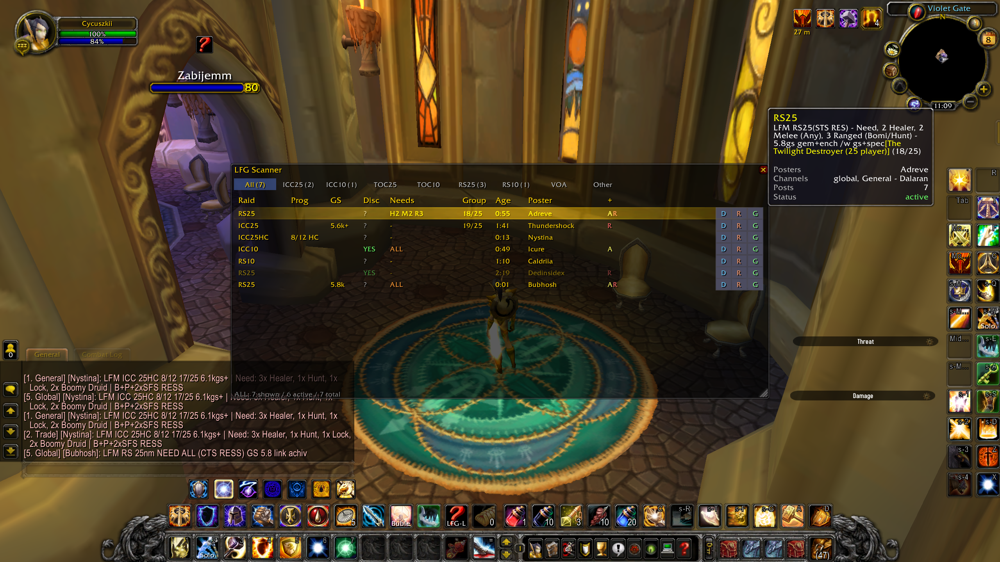

# LFG Scanner

Live raid-LFM tracker for WoW WotLK 3.3.5a (Warmane). Stop scrolling
chat to find a raid - the addon reads `/general`, `/global`, `/trade`,
`/world`, and `/lookingforgroup` for you and shows every active LFM in
one clean, deduplicated table.



## What you get

- **One row per raid, not eight.** Multi-channel posts, reposts, and
  multi-officer cross-posts collapse into a single entry.
- **At-a-glance info:** raid + difficulty (`ICC25HC`), boss progress
  (`8/12`), required GearScore, roles still needed, group fill
  (`21/25`), Discord required (yes/no/?), and how long since the last
  repost.
- **Live freshness.** The `Age` column ticks up every second since the
  poster's last message. After 2 min of silence the row greys out;
  after 5 min it drops off.
- **One-click whisper.** Click any row to open `/w <poster>`. Or use
  the per-row quick-action buttons to send a canned question:
  - **D** - "discord required?"
  - **R** - "any reserves?"
  - **G** - "min gs?"
- **Filter by content.** Tabs across the top: `All`, `ICC25`, `ICC10`,
  `TOC25`, `TOC10`, `RS25`, `RS10`, `VOA`, `Other` (with a live count
  next to each).
- **Stable row order.** Rows are sorted by when they first appeared,
  so existing entries don't jump around when someone reposts.
- **Tooltip on hover** shows the full original posting, list of
  posters, channels it was seen on, post count, and the `@nick` leader
  if mentioned.
- **Filtered noise.** Guild recruitment, boost-selling, item-selling,
  achievement-run-only postings, and non-English chat (RU translit,
  DE, SR, etc.) are detected and excluded.

## Install

1. Download the latest `LFGScanner-x.y.z.zip` from the
   [Releases](../../releases/latest) page.
2. Unzip into your client's `Interface/AddOns/` folder. The ZIP
   already contains a top-level `LFGScanner/` directory - put it next
   to your other addons.
3. Log in (or `/reload`). On Warmane, make sure "Load out of date
   AddOns" is checked on the character select screen.

## Usage

The `LFG Scanner` frame appears automatically after login. Drag the
title bar to move it; grab the bottom-right corner to resize. Layout
is remembered.

### Slash commands

| Command           | Effect                                      |
|-------------------|---------------------------------------------|
| `/lfg`            | toggle window                               |
| `/lfg show`       | show window                                 |
| `/lfg hide`       | hide window                                 |
| `/lfg reset`      | clear the active-raid table                 |
| `/lfg stats`      | print the number of tracked raids           |
| `/lfg resetpos`   | restore default frame position and size     |

### Reading the table

```
Raid       Prog      GS     Disc  Needs       Group  Age   Poster      +
ICC25HC    8/12 HC   6.2k+  YES   T1 R3       21/25  0:14  Shyyshyy   AR  [D][R][G]
RS25       -         5.8k+  ?     R1          24/25  0:42  Bagulor    A   [D][R][G]
```

- `Needs`: `T`/`H`/`M`/`R`/`D` = tank/heal/melee/ranged/dps. `T1 R3` =
  one tank + three ranged. `ALL` (orange) means the poster wrote
  "Need ALL".
- `+` column flags: `A` = achievement required, `R` = has a reserves
  block.
- Inactive rows (no post for 2-5 min) are dimmed; they disappear after
  5 min of silence.

## Compatibility

- WoW 3.3.5a (Wrath of the Lich King). Tested on Warmane Icecrown.
- Pure Lua, no external library dependencies (no Ace3, no LibStub).

---

## Status

- **Phase 1 (done):** `LFGScannerLogger` companion addon - captures
  raw chat for sample collection. Useful for contributing better
  parser dictionaries; not needed by end users.
- **Phase 2 (current):** `LFGScanner` itself - the live tracker
  described above. Code complete, in-game iteration ongoing.
- **Phase 3 (future):** per-character profiles, Polish-language
  patterns, export to clipboard, leader-merge across officer reposts.

See [docs/PHASES.md](docs/PHASES.md) for details.

## Documentation

- [docs/PHASES.md](docs/PHASES.md) - project phases and roadmap.
- [docs/ARCHITECTURE.md](docs/ARCHITECTURE.md) - layout, WoW APIs
  used, design decisions.
- [docs/PARSING.md](docs/PARSING.md) - how messages are classified and
  what fields the parser extracts. Living document, derived from real
  Warmane data.
- [docs/sample-postings.md](docs/sample-postings.md) - manually
  labeled real postings used as parser test fixtures.

## Building from source

```bash
# Deploy every addon in ./addons/ to the WoW client
./scripts/deploy.sh

# Just one
./scripts/deploy.sh LFGScanner

# Custom client path (default is $HOME/Games/wow)
WOW_DIR=/path/to/wow ./scripts/deploy.sh
```

The script copies each addon directory 1:1 into
`$WOW_DIR/Interface/AddOns/`, replacing the previous version. Run
`/reload` in-game afterwards.

Releases are produced by a GitHub Action on `v*` tag pushes - it ZIPs
each addon directory under `addons/` and attaches them to the GitHub
Release page. End users don't need this repo, just the ZIP.

## Companion addon: LFGScannerLogger

A separate, minimal addon that just records raw chat into
SavedVariables. Used for collecting samples to improve the parser. Not
required for normal use.

If you'd like to contribute samples:

1. `./scripts/deploy.sh LFGScannerLogger`
2. Play with the addon enabled. Use `/lfglog stats` for a count,
   `/lfglog clear` to wipe the buffer.
3. Run `/reload` (or log out) so SavedVariables flush to disk - do
   this for **each account separately**, since SavedVariables is
   per-account.
4. Pull the file(s) into the repo:
   ```bash
   ./scripts/collect-logs.sh                       # all accounts
   ./scripts/collect-logs.sh ACCOUNT1 ACCOUNT2     # only the listed
   ```
   Files land in `data/samples/<ACCOUNT>/` (gitignored).

### Stored data format

`LFGScannerLoggerDB` (a Lua table in SavedVariables):

```lua
LFGScannerLoggerDB = {
  meta     = { version = 1 },
  sessions = {
    { started_at = <epoch>, realm = "...", player = "...", zone_at_login = "...", client_locale = "..." },
    ...
  },
  current_session_index = N,
  entries = {
    -- short keys to keep file size down
    { t = <epoch>, s = <session_idx>, a = "Author", c = "General", cs = "General - Dalaran",
      ci = 1, z = "Dalaran", m = "LFM ICC25 need 2 heal 1 dps...", g = "0x..." },
    ...
  },
}
```

Cap: the most recent 50,000 entries (older ones are trimmed on save).

## License

[MIT](LICENSE).
